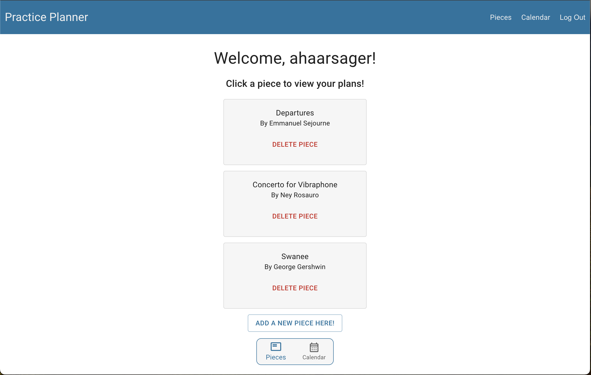
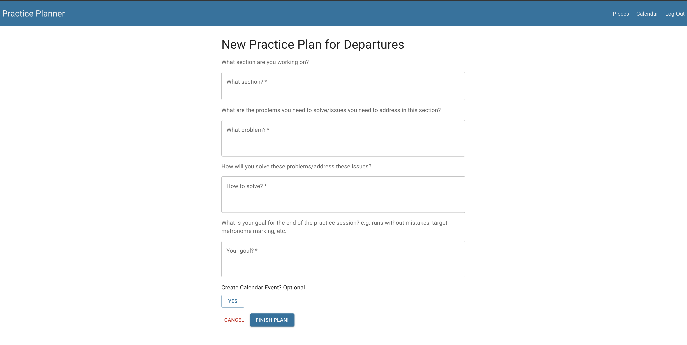
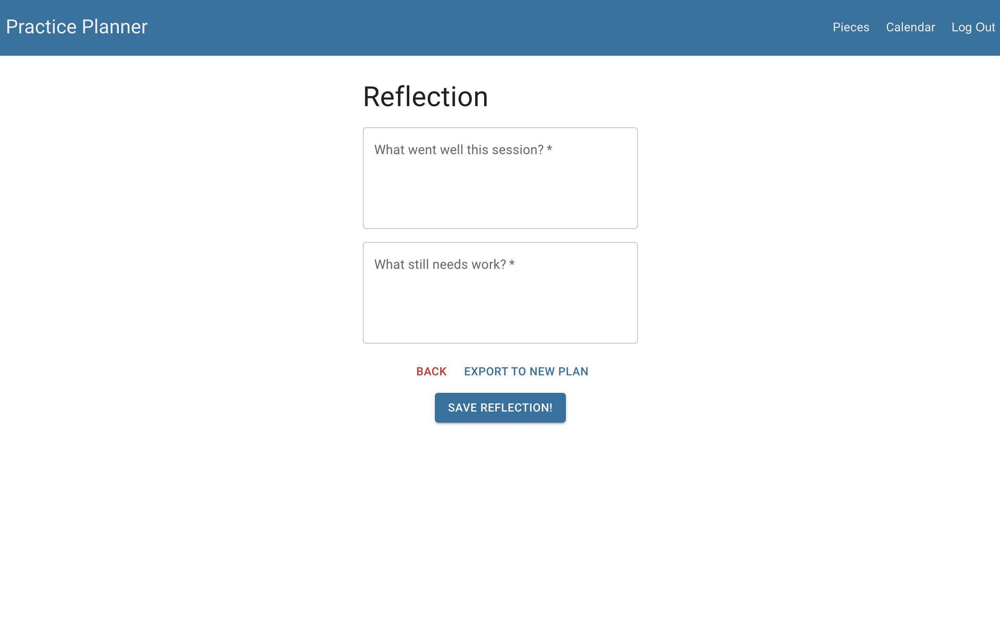
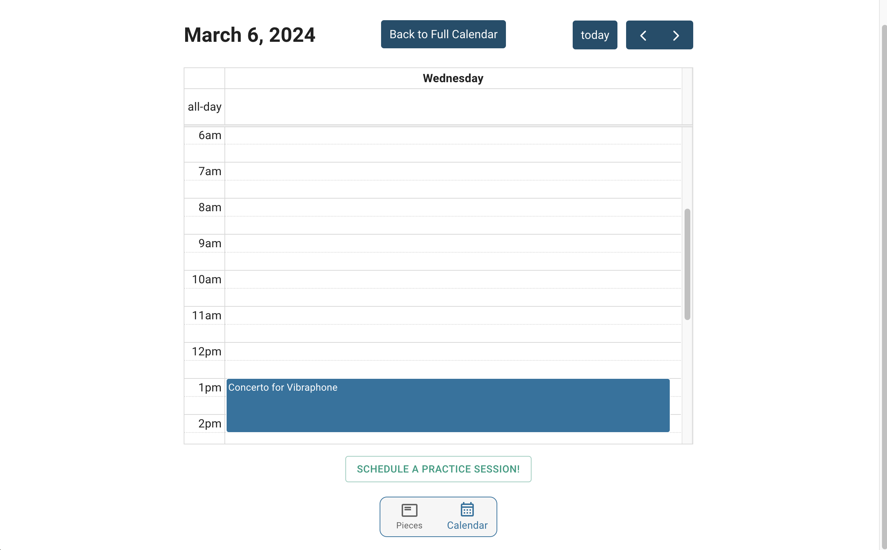

# PRACTICE PLANNER

## Description

_Duration: 2 Weeks_

This application is a planner/organizer made to help musicians better plan and schedule their practice sessions. To that end, the app provides three major features: practice plans, reflections, and calendar events. 

A practice plan is essentially a journal entry where users can pre-plan what they wish to accomplish in a given practice session. For each plan, the user will have four questions to answer that will help them clarify and break down what they need to accomplish in their practice session so they can make the best use of their time. 

Reflections are exactly what they sound like. After a user has finished their practice session in real life, they can open the practice plan they wrote for that session and write a reflection. Reflections are broken down into two prompts: "What went well?" and "What still needs work?" If the user would like, they can click the "Export to New Plan" button at the end of the reflection to immediately begin writing their next practice plan with one of the fields filled out based on what they wrote in their reflection.

Calendar events are used to schedule when a user would like to practice a particular piece of music. By simply clicking on a given day on the calendar and pressing the "Schedule a Practice Session!" button, users can add an event, representing a real-life practice session to the app's calendar. Calendar events are simply titled with the name of the piece the user wishes to practice.

Note: calendar events and practice plans can be created independently of one another OR created simultaneously and connected together. This application was made with flexibility in mind, so it does not matter which is created first. Both the Calendar screen and New Practice Plan screen provide options for connecting practice plans and calendar events together if the user wishes.

## Screen Shots

## Getting Started

### Prerequisites

- [Node.js](https://nodejs.org/en/)
- [Postgres](https://www.postgresql.org/download/)
- [Postico](https://eggerapps.at/postico/v1.php)

### Installation
1. Create a database named `practice_planner`
2. Use the queries in the `database.sql` file to create all the necessary tables. I recommend using Postico (linked above) to run those queries as that is what was used to create the queries. 
3. Open up your editor of choice and run `npm install`.
4. Run `npm run server` in your terminal.
5. Run `npm run client` in your terminal.
6. Click the link given by `npm run client` to opena new tab with the running project!
